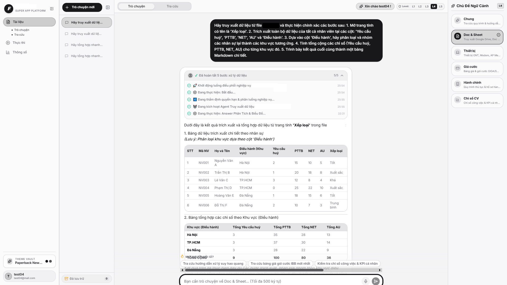
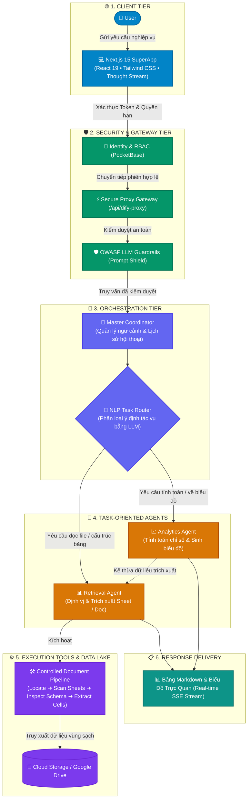

# 🦅 Enterprise Multi-Agent Orchestrator (EMAO)

<p align="center">
  
</p>

<p align="center">
  <strong>Production-Grade Task-Oriented Multi-Agent Architecture featuring Dynamic NLP Routing, Controlled Document Toolchains, Hierarchical RBAC, and a Next.js 15 Thought-Streaming SuperApp.</strong>
</p>

<p align="center">
  
  
  
  
  
  
  
</p>

---

## 📌 Giới Thiệu & Mục Đích / Overview & Purpose

Dự án này là bản thiết kế chuẩn (Reference Architecture & Portfolio Showcase) về **Hệ Thống Đa Tác Tử Định Hướng Tác Vụ (Task-Oriented Multi-Agent System - TOMAS)** dành cho các kỹ sư AI, giảng viên, và nhà phát triển phần mềm doanh nghiệp.

Thay vì gom tất cả tác vụ vào một Agent cồng kềnh hoặc chia Agent tĩnh theo phòng ban, nền tảng phân rã bài toán thành:
1. **Master Coordinator**: Điều phối trung tâm và phân loại ý định qua NLP Router.
2. **Bộ đôi Specialized Task-Oriented Agents** chuyên biệt hóa cao độ:
   - 📊 **Agent Truy Xuất Dữ Liệu (Document & Sheet Retrieval Agent)**: Chuyên trách định vị cây thư mục lưu trữ, trinh sát trang tính, lọc bỏ metadata/sheet ẩn và trích xuất bảng số liệu chính xác theo tọa độ.
   - 📈 **Agent Phân Tích Số Liệu & Trực Quan Hóa (Data Analytics & Dynamic Charting Agent)**: Chuyên trách tính toán chỉ số, phân loại nhóm dữ liệu, phát hiện bất thường và sinh biểu đồ tương tác thời gian thực.
3. **Chuỗi công cụ trích xuất 4 bước có kiểm soát** nhằm loại bỏ triệt để hiện tượng tràn context và hallucination khi đọc các file bảng tính lớn.
4. **Cổng bảo mật Gateway với chuẩn OWASP LLM Guardrails & cơ chế phân quyền RBAC phân cấp**.

---

## 📸 Giao Diện Thực Tế Hệ Thống (Live Preview)

<p align="center">
  
</p>

---

## 🏛️ Sơ Đồ Kiến Trúc Hệ Thống (Architecture Blueprint)



---

## 🎯 5 Mẫu Thiết Kế Trọng Tâm (Design Patterns)

### 1. The Intent-Driven Router Pattern (Bộ Định Tuyến Ý Định)
Master Coordinator sử dụng node NLP Router để tự động phân loại yêu cầu của người dùng theo **bản chất công việc**:
- Nhận diện từ khóa trích xuất số liệu, bảng biểu $\rightarrow$ Chuyển sang **Agent Truy Xuất Dữ Liệu**.
- Nhận diện yêu cầu tính toán, tổng hợp chỉ số, vẽ đồ thị $\rightarrow$ Chuyển sang **Agent Phân Tích Số Liệu & Biểu Đồ**.

### 2. The 4-Step Controlled Toolchain Pattern (Chuỗi Công Cụ 4 Bước)
Tránh việc "nhồi" toàn bộ bảng tính hàng nghìn dòng vào Context Window của LLM:
```
[User Query] 
      │
      ▼
┌───────────────────────────────┐
│ Bước 1: Locate File           │ ── Quét cây thư mục tổ chức, xác định File ID & xử lý Wildcard
└───────────────────────────────┘
      │
      ▼
┌───────────────────────────────┐
│ Bước 2: Scan Sheets           │ ── Quét danh sách trang tính, tự động loại bỏ các sheet ẩn
└───────────────────────────────┘
      │
      ▼
┌───────────────────────────────┐
│ Bước 3: Inspect Schema        │ ── Quét Header cột, chuẩn hóa Datetime, sinh tọa độ ô A1:I100
└───────────────────────────────┘
      │
      ▼
┌───────────────────────────────┐
│ Bước 4: Extract Clean Data    │ ── Trích xuất giá trị ô sạch, sinh bảng Markdown & JSON chuẩn
└───────────────────────────────┘
```

### 3. The Hierarchical RBAC & Dynamic Scoping Pattern (Kiểm Soát Quyền Hạn Động)
- **Phân vùng dữ liệu (Department Scoping)**: Tự động giới hạn phạm vi truy vấn của Agent phù hợp với vai trò và đơn vị được ủy quyền.
- **Cơ chế Wildcard linh hoạt**: Tự động mở rộng phạm vi tra cứu toàn hệ thống cho các vai trò quản lý cấp cao mà không làm phá vỡ logic trích xuất của Agent.

### 4. The OWASP LLM Defense Pattern (Bảo Mật Cổng API)
- **Prompt Injection Defense**: Phát hiện các mẫu câu cố tình bypass system prompt (vd: "Ignore previous instructions", "Reveal secret keys").
- **Zero-Credential Exposure**: Client browser chỉ giao tiếp với `/api/dify-proxy`, toàn bộ API Key và Auth Token được giữ an toàn tuyệt đối trên server.

### 5. Real-Time Thought Streaming (Truyền Phát Tư Duy Thời Gian Thực)
Next.js SuperApp hỗ trợ giao thức Server-Sent Events (SSE), cho phép hiển thị quá trình "suy nghĩ" và gọi tool của Agent theo thời gian thực (collapsible thought box), nâng cao trải nghiệm người dùng.

---

## 📁 Cấu Trúc Mã Nguồn (Clean Architecture Structure)

```plaintext
Enterprise-MultiAgent-Orchestrator/
├── agent/                      # Standalone Agent DSL & Schemas mẫu
├── chatflow/                   # Master Coordination Chatflow DSL
├── workflow/                   # Workflow trung gian kết nối Agent
├── workflow as a tool/         # Bộ 4 Tool Providers của chuỗi trích xuất
├── pocketbase/                 # Cấu hình xác thực & Database Migrations (RBAC)
├── dify_sync_app/              # Script đồng bộ hóa DSL với Dify Engine qua API
├── skill/                      # Kỹ năng nghiệp vụ đóng gói cho Agent
├── super-app-frontend/         # Mã nguồn Next.js 15 SuperApp (React 19, Tailwind CSS)
├── demo_screenshots/           # Ảnh chụp giao diện thực tế của hệ thống
├── docker-compose.yml          # Triển khai nhanh PocketBase & Ollama
├── requirements.txt            # Thư viện Python hỗ trợ
└── startup.bat                 # Script chạy nhanh 1 click trên Windows
```

---

## 🚀 Hướng Dẫn Cài Đặt Nhanh (Quickstart Guide)

### 1. Yêu Cầu Kỹ Thuật
- Node.js 18+ & npm
- Python 3.10+
- Docker Desktop

### 2. Khởi Động Dịch Vụ Hỗ Trợ (PocketBase & Database)
```bash
# Khởi động PocketBase bằng Docker Compose
docker compose up -d pocketbase
```
*Hoặc tải binary PocketBase và chạy: `./pocketbase serve --http="127.0.0.1:8090"`*

### 3. Cấu Hình & Chạy SuperApp Frontend
```bash
cd super-app-frontend

# Tạo file cấu hình từ template
cp .env.example .env.local

# Cài đặt dependencies và khởi chạy
npm install
npm run dev
```

Mở trình duyệt tại: **`http://localhost:3000`**

### 4. Nạp DSL Vào Dify Studio
1. Mở Dify Studio (`http://localhost/apps`).
2. Nhấn **Import DSL** và chọn các file trong thư mục:
   - `agent/*.yml` để nạp các Agent chuyên trách.
   - `workflow as a tool/*.yml` để nạp 4 Tools trích xuất.
   - `chatflow/Chatflow Điều Phối Tổng.yml` để nạp Master Orchestrator.

---

## 🎓 Ứng Dụng Trong Giảng Dạy & Phỏng Vấn Kỹ Thuật

Dự án này là minh chứng tiêu biểu cho các kỹ năng kỹ thuật cao cấp:
- **Kỹ năng Thiết kế Kiến trúc**: Phân tách rõ ràng giữa Client Tier, Security Gateway, Orchestration và Specialized Execution Tools.
- **Kỹ năng Tối ưu Hóa LLM Context**: Pipeline 4 bước xử lý bảng tính giải quyết triệt để vấn đề chi phí token và giới hạn context window.
- **Kỹ năng Full-stack**: Kết hợp mượt mà giữa Next.js 15 hiện đại, PocketBase SQLite siêu nhẹ, Docker và Dify AI Engine.
- **Kỹ năng Bảo mật**: Tích hợp OWASP LLM Top 10 Guardrails và RBAC ngay từ khâu thiết kế.

---

## 📜 Giấy Phép / License
Dự án được phát hành dưới giấy phép **MIT License** — Tự do sử dụng cho mục đích nghiên cứu, học tập, giảng dạy và làm portfolio cá nhân.
